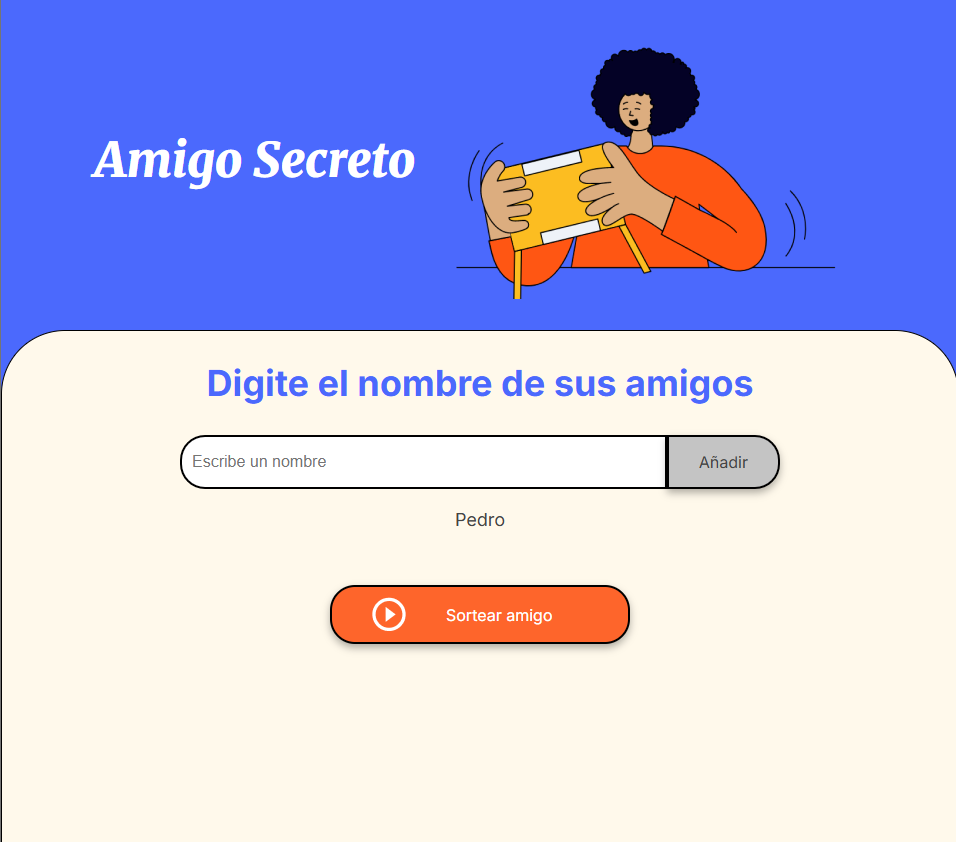
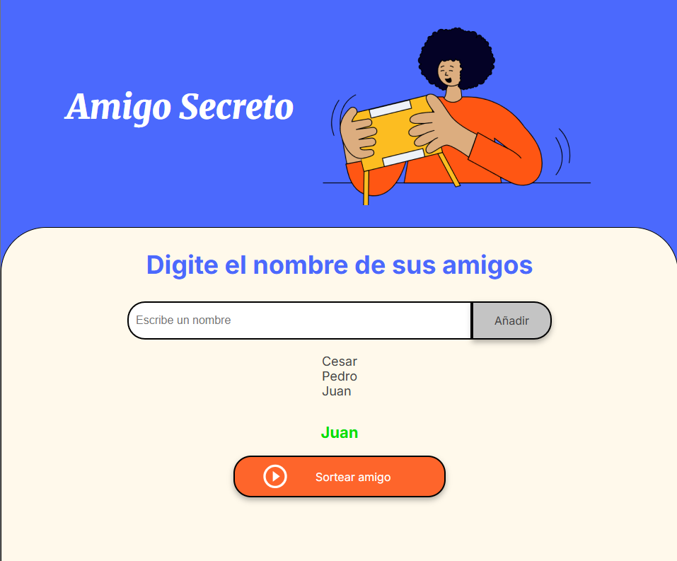

## Amigo Secreto
Programa que permite agregar nombres de amigos, y a partir de estos generar una lista y poder obtener uno de forma aleatoria.
## ¿Como usar?
La página principal te muestra el estado inicial del juego, en un principio se ve un cuadro de texto para escribir el nombre, un boton de agreagar y uno de sortear amigo.

Para pulsar el boton de agregar, es necesario tener un nombre escrito en el cuadro de texto, de lo contrario se validará y aparecerá una alerta indicando este error, al agregar el amigo se mostrará este en pantalla.

Al tener amigos agregados podemos pulsar el boton sortear amigo para generar un amigo aleatorio, si no hay amigos y queremos sortear aparecerá una alerta indicando este error, al sortear el amigo este se mostrará en pantalla.

